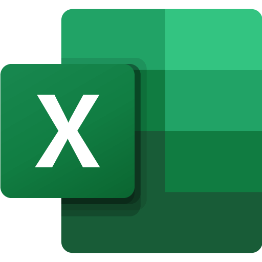
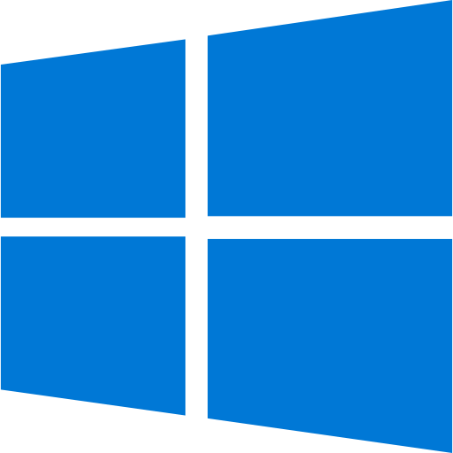

[]
### Hi there, I'm [Sudarshan Kakad]() 👋

I am pursuing Btech Degree in Computer Science Engineering from [Nutan College of Engineering & Research](https://ncerpune.in), Pune. Apart from that, I am a MERN Stack developer who loves building responsive web pages and contributing to open source.

**My Interest**:
- Web Development
- Software Development
- Competative Programming

 **I am open to**:

- Any collaboration work
- Web Development Projects
- Research Internships
- Available to become a reviewer or PC member for Machine Learning/Data mining journals or conferences.

## Skills:

#### Languages:

 

#### Technologies/Frameworks:

 

#### Database

 

#### Business Tools

 

#### IDEs

 

#### Operating Systems:

 

## Connect with me:

|  |  |
| ------------- | ------------- |

<!-- 
----

 -->

<!--
**themlphdstudent/themlphdstudent** is a ✨ _special_ ✨ repository because its `README.md` (this file) appears on your GitHub profile.

Here are some ideas to get you started:

- 🔭 I’m currently working on ...
- 🌱 I’m currently learning ...
- 👯 I’m looking to collaborate on ...
- 🤔 I’m looking for help with ...
- 💬 Ask me about ...
- 📫 How to reach me: ...
- 😄 Pronouns: ...
- ⚡ Fun fact: ...
-->
